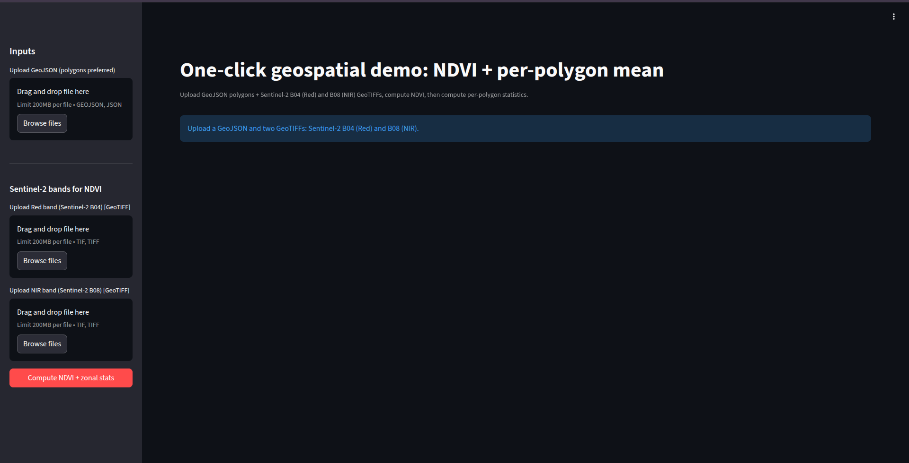
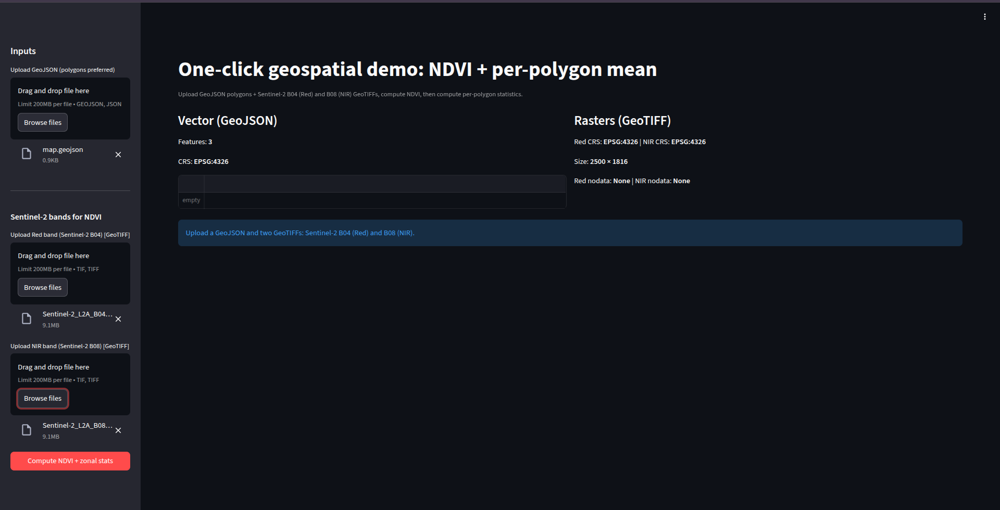
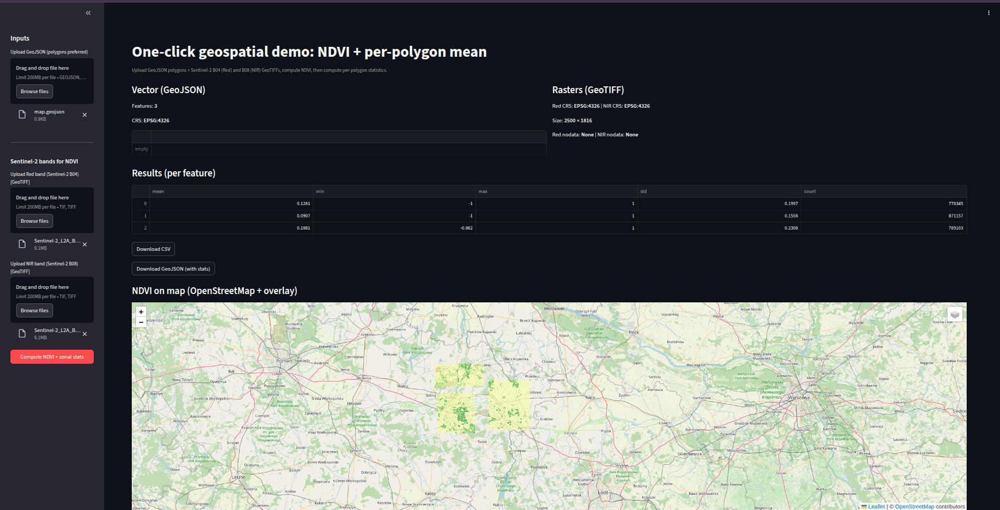

# streamlit-geo-raster-app

One-click geospatial demo: **NDVI from Sentinel/Copernicus + per-polygon statistics** using **GeoPandas + Rasterio**, served in **Streamlit** and containerized with **Docker Compose**.

This app demonstrates **vector + raster processing together**:
- compute NDVI from Sentinel-2 bands (B04 red, B08 NIR)
- compute **zonal statistics per polygon** (mean/min/max/std/count)
- visualize NDVI as an overlay on a basemap (OpenStreetMap)
- export results as **CSV** and **GeoJSON**

---

## Screenshots

### App home page


### Loaded prerun app home page


### Zonal stats result table + NDVI overlay on basemap



---

## Features

- Upload **GeoJSON** vector polygons (**GeoPandas**)
- Upload Sentinel-2 band rasters **GeoTIFF** (**Rasterio**):
  - **B04** = Red
  - **B08** = NIR
- Automatic checks:
  - CRS alignment
  - same raster grid (size/transform)
  - polygon ↔ raster overlap
  - NDVI sanity check (finite pixels)
- Compute NDVI and then **zonal statistics per polygon**
- Preview NDVI:
  - colored NDVI overlay on **OpenStreetMap**
- Download results:
  - **CSV** (attributes + stats)
  - **GeoJSON** (geometry + attributes + stats)

---

## Requirements

- Docker + Docker Compose (recommended)
- No Python installation required (everything runs in containers)

---

## Run (Docker Compose)

From the repo root:

```bash
docker compose up --build
```
Then open:
```
http://localhost:8501
```
Stop with:
```commandline
Ctrl + C
docker compose down
```


## Input data formats (IMPORTANT)
**1) Vector input (GeoJSON)**

- File: `.geojson` (polygons preferred)

- CRS: any (the app reprojects vector to raster CRS internally)

**2) Raster inputs (GeoTIFF)**

You must upload **two separate single-band GeoTIFFs**:

- **Red band**: Sentinel-2 **B04**

- **NIR band**: Sentinel-2 **B08**

✅ They must match:

- same CRS

- same width/height

- same affine transform (pixel alignment)

--- 

## How to get Sentinel-2 B04/B08 GeoTIFFs that overlap your polygons
### Recommended workflow (reliable overlap)

1. Use **Copernicus Browser / Sentinel Hub** to locate your area and date.

2. Export **analytical data** (not “image preview”).

3. Download GeoTIFFs for:
   - B04 (red)
   - B08 (nir)

4. Ensure your GeoJSON polygons cover the same area as the raster tile.

---

## How to use the app

1. Upload **GeoJSON** polygon file.

2. Upload **B04 (Red)** GeoTIFF.

3. Upload **B08 (NIR)** GeoTIFF.

4. Click **Compute NDVI + zonal stats**.

5. Review:

   - NDVI stats + table per polygon

   - NDVI overlay map preview

6. Download outputs:

   - CSV
   - GeoJSON (with stats)

---

### Output columns

For each polygon you get:

  - `feature_id` (1..N)

    - `mean`, `min`, `max`, `std`, `count`

Where `count` is the number of raster pixels used inside the polygon.

---

## Repo structure

- `app/` Streamlit application

- `core/` NDVI + zonal stat utilities

- `docker-compose.yml` container orchestration

- `Dockerfile` image build

- `environment.yml` conda environment (micromamba)

- `sample_data/` example inputs 

- `docs/screenshots/` README screenshots

---

### Tech stack

- Streamlit (UI)

- GeoPandas (vector)

- Rasterio (raster)

- NumPy/Pandas (processing)

- Folium + streamlit-folium (basemap overlay)

- Docker Compose (containerization)
